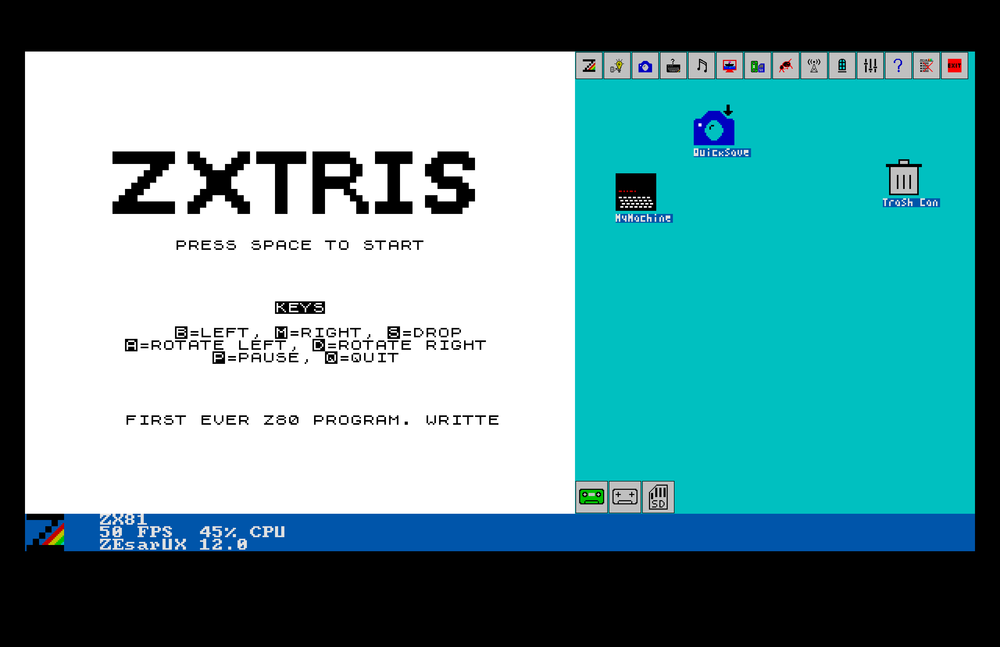
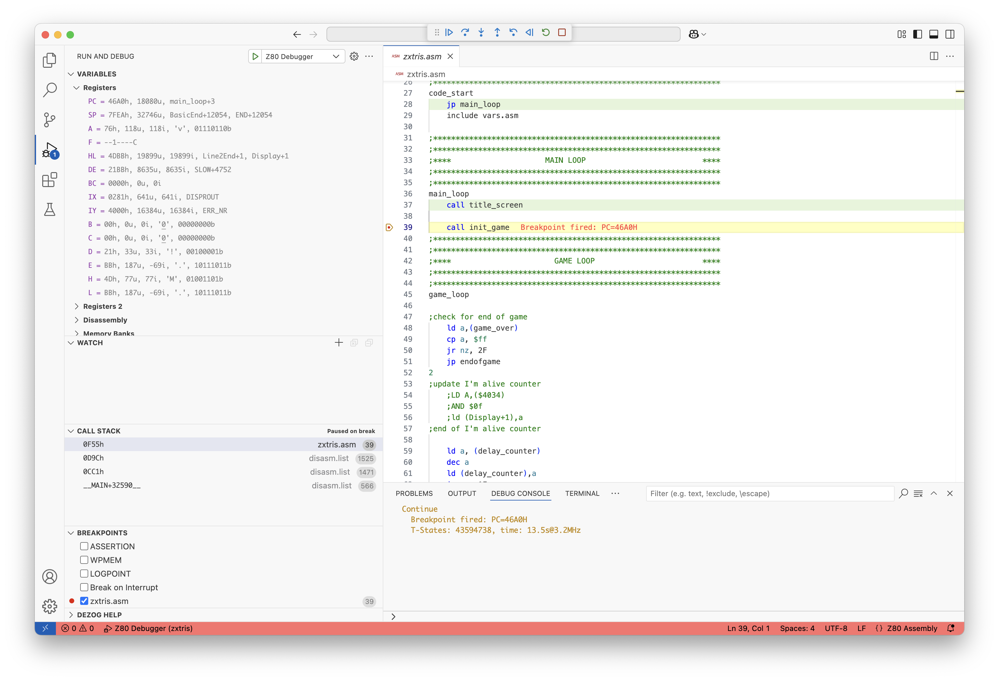

# ZXTRIS 

Tetris clone for the ZX81 written in Z80 using VSCode, SjASMPlus & Dezog.

My first ever Z80 program (so the code is likely a long way from being optimal!)

Dezog enables step by step debugging of Z80 code from within the VS Code environment. This was relatively easy to set-up (but, it's never that simple once you start messing with the JSON files!). The tasks.json and launch.json files are in the .vscode folder. Basically, you can compile (using the SjASMPlus task), set break points in VSCVode and then debug using Dezog and the ZEsarUX emulator. Must have been much harder "back in the day".

I did all of the initially on an Intel based Mac, but I've also duplicated the environment on a Windows PC. I recently moved to Mac Silicon and struggled to get the latest 1.20.x versions of SjASMPlus to compile (an error finding the header files for the LUA stuff) and I had to revert to version 1.19 which complied OK with a simple make.

